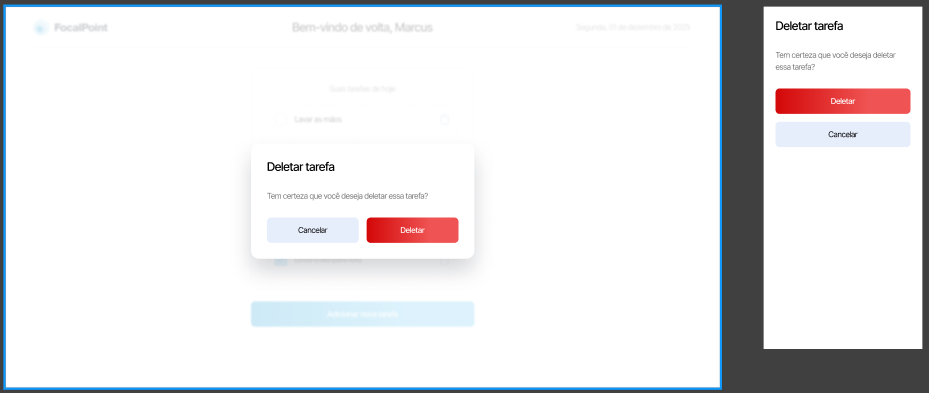
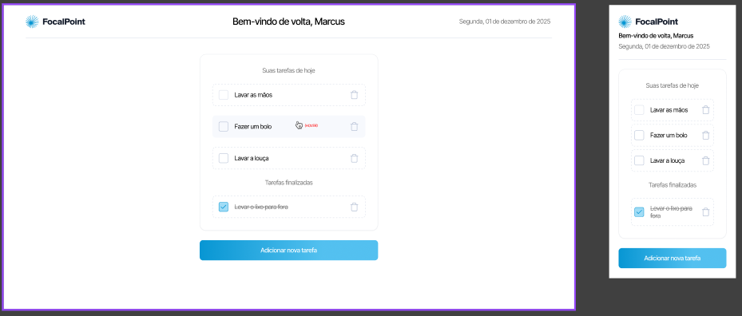
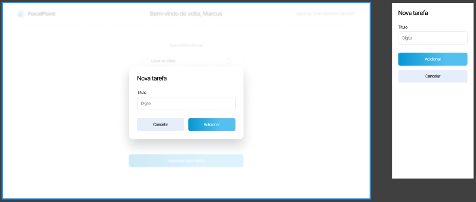

#  MKS Sistemas - E-commerce






# Projeto

Lista de tarefas.

# Funcionalidades Principais

- Lista de tarefas

- Adicionar nova tarefa.
- Excluir tarefa.
- Concluir tarefa

# Tecnologias

- Next
- TypeScript
- SASS


# Como usar?
Antes de começar, você precisa ter o Git e o Node instalados.

```bash
# Clone this project
git clone https://github.com/Diegoh-dev/legaplan.git
# access
cd legaplan
# install dependencies
 yarn
# Run the project
$ yarn dev
```
    

# Colaboradores

- Diegoh-dev
